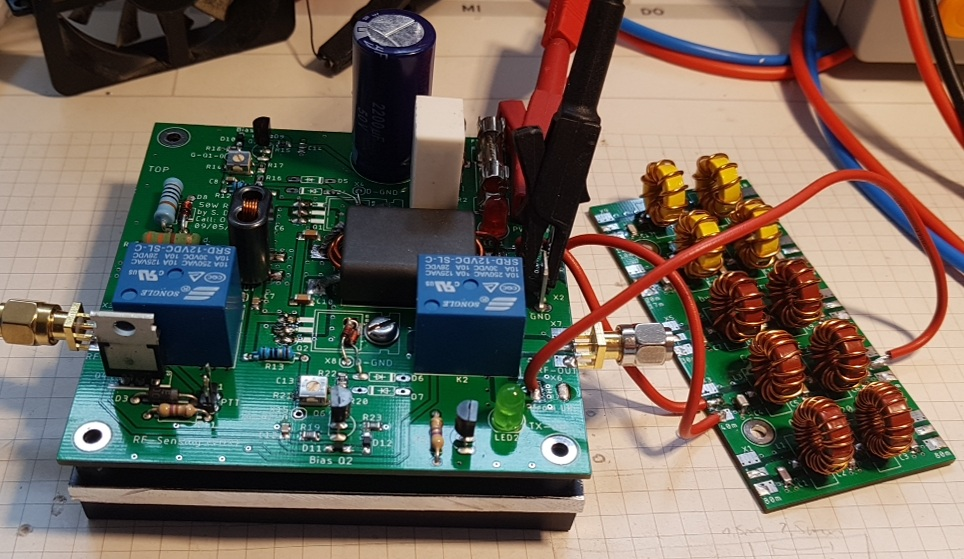
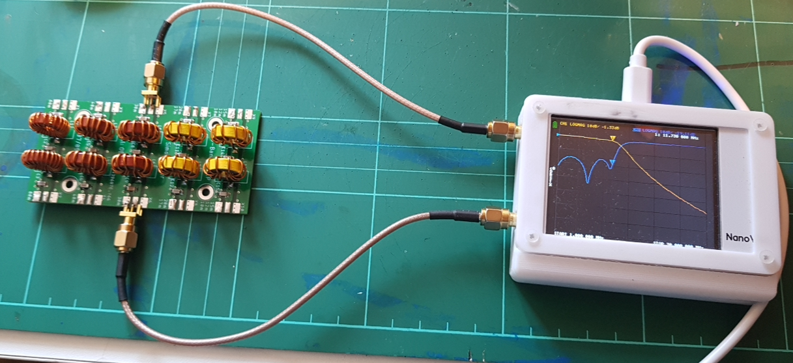

# 5-Band-50W-PA-OE3SDE
 50W 5-Band (80m, 40m, 30m, 20m and 10m) SSB PA inspired by W6JL.

## Block Diagram

**Figure 1**: Block diagram of 50W 5-Band (80m, 40m, 30m, 20m and 10m) SSB PA.

## Results

**Figure 2**: Setup of 50W PA and LC lowpass filter.

## LC Lowpass Filters

**Figure 3**: Top view of LC lowpass filter PCB.

**Figure 4**: Measurement of LC lowpass filter with NanoVNA.

## **50W Power Amplifier**

**Figure 5**: Top view of 50W PA PCB.

**Figure 6**: Bottom view of 50W PA PCB.